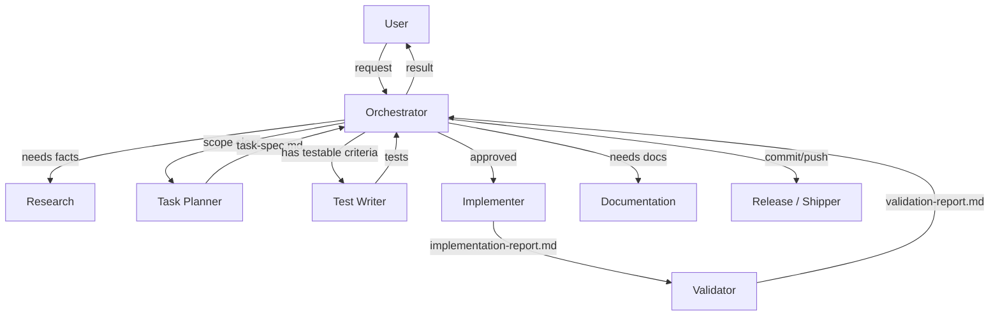

# OpenCode Dispatcher

## Table of Contents

- [Table of Contents](#table-of-contents)
- [What It Does](#what-it-does)
- [Install](#install)
- [First use in a project](#first-use-in-a-project)
- [What gets installed](#what-gets-installed)
- [Install safety](#install-safety)
- [Restore or uninstall](#restore-or-uninstall)
- [Package commands](#package-commands)
- [Publication status](#publication-status)
- [Limitations](#limitations)

OpenCode Dispatcher is a workflow pack for OpenCode. It installs specialist agents so substantial coding work can run from explicit task specs instead of long chat history.

It is useful when you want agent work to be easier to inspect, resume, and validate:

- task scope in `.ai/tasks/<task-id>/task-spec.md`
- durable project facts in `.ai/context.md`
- role boundaries between planning, test writing, implementation, documentation, validation, research, and shipping work
- short handoffs in chat, with details kept in task artifacts
- validation reports checked against the approved scope

For tiny one-off edits, plain OpenCode is often enough.

## What It Does

OpenCode Dispatcher replaces OpenCode's default single-agent approach with a team of specialist agents coordinated through file-based artifacts. Each agent has a defined role and boundary. The orchestrator routes work, delegates to the right agent, and synthesizes results back to you.

All task state lives in `.ai/tasks/<task-id>/` artifacts — task specs, implementation reports, validation reports, documentation reports — rather than in chat history.

| Agent | Role | When |
|---|---|---|
| Orchestrator | User-facing coordinator; routes work, synthesizes results | Always active |
| Task Planner | Creates auditable `.ai/tasks/<id>/task-spec.md` | Used before implementation |
| Test Writer | Writes tests from testable acceptance criteria | Used before implementation (test-driven) |
| Implementer | Edits source code per approved task spec | Used after spec is approved |
| Validator | Checks results against task spec and writes `validation-report.md` | Used after implementation |
| Documentation | Updates docs, context, decision artifacts | Used when docs are needed |
| Research | Gathers external facts, comparisons, best practices | Used when facts are needed |
| Release / Shipper | Git commit and push only | Used when explicitly requested |



Compared to plain OpenCode:

| Dimension | Plain OpenCode | OpenCode Dispatcher |
|---|---|---|
| Task scope | Chat history | File-based `.ai/tasks/<id>/task-spec.md` |
| Agent model | Single agent | Specialist agents with role boundaries |
| Validation | Implicit (trust the output) | Explicit (validator checks against spec) |
| Resumability | Scroll chat history | Read task spec + validation report |
| Audit trail | Chat log | Git-tracked artifacts |
| Best for | Quick edits, one-off questions | Substantial features, multi-step work |

## Install

Install from the npm registry:

```bash
npx opencode-dispatcher install
```

After installing, restart OpenCode so it reloads `~/.config/opencode`.

### Install from source

```bash
npm run check
npm run install:local
```

Equivalent direct commands:

```bash
node ./bin/install.js check
node ./bin/install.js install
```

The default installer command is `install`, so this is also valid:

```bash
node ./bin/install.js
```

## First use in a project

1. Run the install command.
2. Restart OpenCode so it reloads `~/.config/opencode`, then open the project.
3. If the project does not already have `.ai/context.md`, the orchestrator initializes `.ai/` before substantial work.
4. For substantial work, ask for a task spec first. Example: `Create a task spec for improving the settings page, then wait for approval.`
5. After approving the task spec, ask the orchestrator to implement and validate it. Example: `Implement the approved task spec at .ai/tasks/settings-page/task-spec.md and run validation.`

The workflow treats live chat as coordination. Durable details belong in `.ai/context.md`, `.ai/tasks/<task-id>/task-spec.md`, and task reports such as `implementation-report.md`, `documentation-report.md`, and `validation-report.md`.

## What gets installed

The installer copies this managed payload into `~/.config/opencode`:

```text
~/.config/opencode/agents/
```

Current package payloads include:

- agents for orchestration, planning, test writing, implementation, documentation, validation, research, and shipping

The installer does not install or manage provider config, model settings, secrets, dependencies, git config, `opencode.jsonc`, `node_modules`, global skills, or templates.

## Install safety

Before copying a managed path, the installer backs up any existing path beside it with a timestamped `.bak-*` suffix, then copies the Dispatcher payload into that path. It does not remove existing directories first, so same-named files may be overwritten and unrelated pre-existing files may remain.

Example backup names:

```text
~/.config/opencode/agents.bak-2026-06-07T12-34-56-789Z
```

Your global `~/.config/opencode/AGENTS.md` is user-owned. OpenCode Dispatcher does not install, overwrite, back up, restore, remove, or rename it.

## Restore or uninstall

To restore a backed-up managed path:

1. Stop OpenCode.
2. Remove or rename the current managed path.
3. Move the matching `.bak-*` path back to its original name.
4. Restart OpenCode.

Example for agents:

```bash
mv ~/.config/opencode/agents ~/.config/opencode/agents.dispatcher
mv ~/.config/opencode/agents.bak-<timestamp> ~/.config/opencode/agents
```

To uninstall Dispatcher, restore your backups if you had pre-existing global agents. Only remove managed paths outright if you do not need any current contents, including files that may have existed before install.

## Package commands

From `package.json`:

```bash
npm run check          # node ./bin/install.js check
npm run install:local  # node ./bin/install.js install
```

The package also defines this binary when installed as an npm package:

```bash
opencode-dispatcher [install|check]
```

Invalid commands print usage and exit with a non-zero status.

## Publication status

This package is published on the npm registry as [`opencode-dispatcher`](https://www.npmjs.com/package/opencode-dispatcher). Install from any project:

```bash
npx opencode-dispatcher install
```

## Limitations

- Managed global `agents` paths are backed up, then overlaid with Dispatcher files; unrelated pre-existing files may remain.
- Restart OpenCode after install, restore, or uninstall so global config is reloaded.
- Providers, models, secrets, project dependencies, and git remotes are not configured by this package.
- The workflow is designed for substantial tasks with scope, artifacts, and validation; it may be unnecessary overhead for tiny edits.
