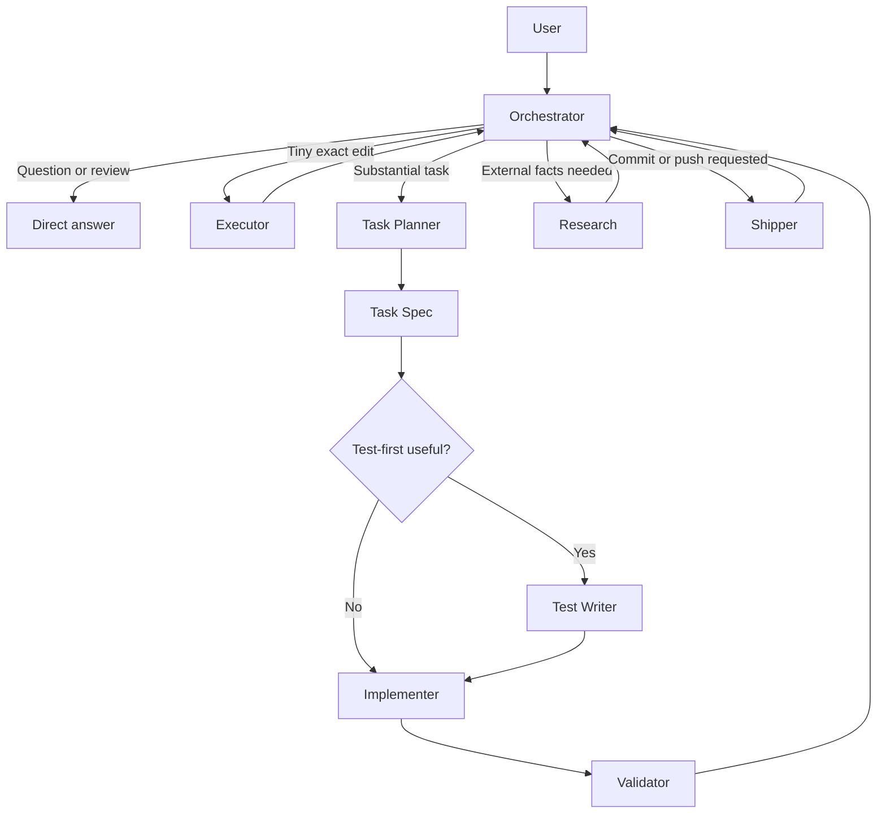
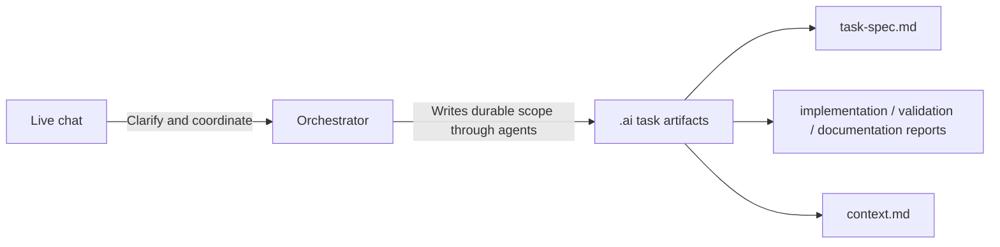
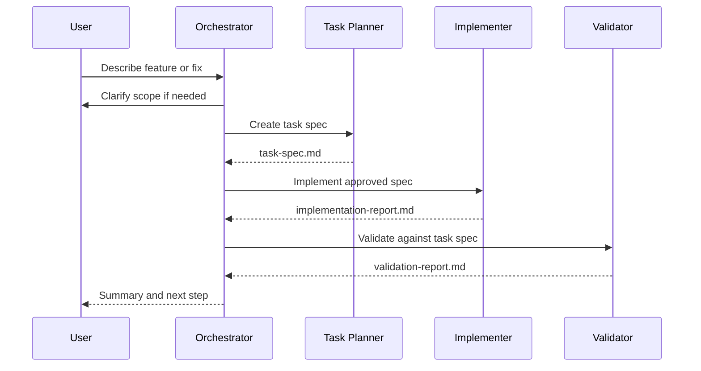
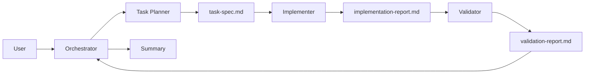
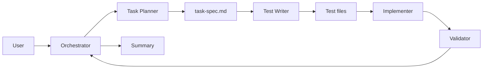
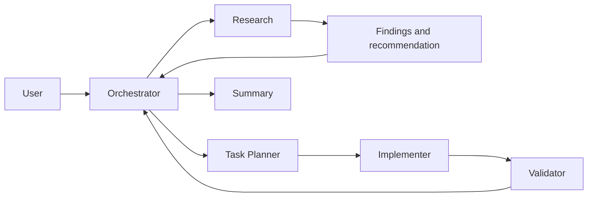
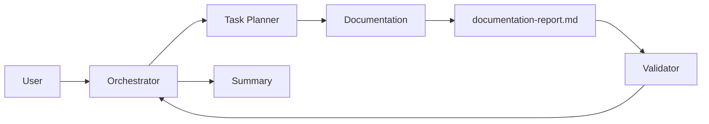
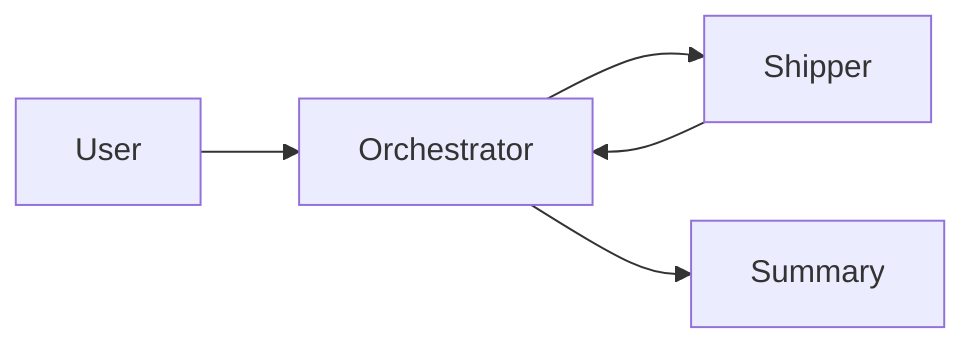

# OpenCode Dispatcher

OpenCode Dispatcher is a workflow pack for OpenCode that adds specialist development agents coordinated through file-based task artifacts.

It is designed for substantial coding work where you want the agent workflow to be easier to inspect, resume, and validate.

Instead of relying on long chat history, Dispatcher keeps durable task state in your project:

```text
.ai/context.md
.ai/tasks/<NNN>-<task-id>/task-spec.md
.ai/tasks/<NNN>-<task-id>/implementation-report.md
.ai/tasks/<NNN>-<task-id>/validation-report.md
.ai/tasks/<NNN>-<task-id>/documentation-report.md
```

For tiny one-off edits or quick questions, plain OpenCode is often enough.

## What Dispatcher Changes

Plain OpenCode is usually a general-purpose agent workflow.

OpenCode Dispatcher adds a user-facing orchestrator and a set of specialist agents. The orchestrator talks with you, clarifies the request, decides how complex the work is, and routes to the smallest safe workflow.

Not every agent runs every time.



The chat is used for coordination. The `.ai/` files become the source of truth for scoped work.

## Why Use It?

Dispatcher is useful when you want agent work to be:

* easier to inspect
* easier to resume later
* easier to validate against an approved scope
* less dependent on chat history
* separated by role boundaries
* safer for multi-step development work
* more suitable for git-tracked project artifacts

It helps answer questions like:

* What exactly was the agent asked to build?
* What files were relevant?
* What was explicitly out of scope?
* What tests or checks were expected?
* What did the implementer change?
* Did the validator check the result against the approved task?

## Compared to Plain OpenCode

| Dimension    | Plain OpenCode                    | OpenCode Dispatcher                           |
| ------------ | --------------------------------- | --------------------------------------------- |
| Task scope   | Usually carried in chat history   | Stored in `.ai/tasks/<NNN>-<id>/task-spec.md` |
| Agent model  | General-purpose agent             | Specialist agents with role boundaries        |
| Validation   | Often implicit                    | Explicit validation against the task spec     |
| Resumability | Requires reading chat history     | Read the task spec and reports                |
| Audit trail  | Chat log                          | Git-trackable `.ai/` artifacts                |
| Best for     | Quick edits and one-off questions | Substantial features and multi-step work      |

## Core Idea

Dispatcher separates live conversation from durable project state.



The orchestrator stays user-facing. Specialist agents do the scoped work.

## Workflow Layers

Dispatcher installs several agents, but they are grouped by when they are used.

### Always Active

| Agent        | Role                                             | Used When     |
| ------------ | ------------------------------------------------ | ------------- |
| Orchestrator | User-facing coordinator and state-machine router | Always active |

The orchestrator is the main entry point. It talks with you, clarifies the request, decides whether work is simple or substantial, delegates to the right specialist, and summarizes results.

### Fast Path

| Agent    | Role                                   | Used When                               |
| -------- | -------------------------------------- | --------------------------------------- |
| Executor | Performs tiny single-file atomic edits | For exact, unambiguous one-file changes |

The executor is used when a full task spec would be unnecessary.

Example:

```text
Change the button label in src/components/SubmitButton.tsx from "Submit" to "Save".
```

If the edit turns out to need multiple files, a new pattern, a dependency, or an architecture decision, the orchestrator escalates the work into the full task workflow.

### Full Task Workflow

| Agent        | Role                                                 | Used When                         |
| ------------ | ---------------------------------------------------- | --------------------------------- |
| Task Planner | Creates task specs and decomposes multi-unit work    | Before substantial implementation |
| Implementer  | Edits source code according to an approved task spec | After planning                    |
| Validator    | Checks completed work against the task spec          | After non-trivial implementation  |

This is the main route for substantial development work.



The task planner creates the approved scope:

```text
.ai/tasks/<NNN>-<task-id>/task-spec.md
```

The implementer makes the smallest correct change according to that scope.

The validator checks the completed work against the approved scope and writes:

```text
.ai/tasks/<NNN>-<task-id>/validation-report.md
```

### Conditional Agents

| Agent         | Role                                                        | Used When                             |
| ------------- | ----------------------------------------------------------- | ------------------------------------- |
| Test Writer   | Writes tests from testable acceptance criteria              | When a test-first flow is useful      |
| Documentation | Updates docs, context, decisions, and documentation reports | When documentation work is needed     |
| Research      | Gathers external facts, comparisons, and best practices     | When source-backed evidence is needed |

These agents are not part of every task.

The test writer is used when the task has clear testable acceptance criteria and writing tests first would improve correctness.

The documentation agent is used when the task needs README updates, project context updates, decision notes, changelog entries, or documentation reports.

The research agent is used when a decision depends on external facts such as official documentation, vendor behaviour, pricing, APIs, or current best practices.

### Bootstrap, Configuration, and Shipping

| Agent        | Role                                                | Used When                                      |
| ------------ | --------------------------------------------------- | ---------------------------------------------- |
| Init         | Bootstraps `.ai/context.md`                         | First use in a project                         |
| Model Config | Assigns models to specific agents in project config | When per-agent model overrides are needed      |
| Shipper      | Handles git commit and push only                    | When explicitly requested                      |

The init agent is used when a project does not yet have `.ai/context.md`.

The model config agent configures per-agent models in `opencode.jsonc`.

The shipper is never used automatically. It only commits or pushes when you explicitly ask for git shipping work.

## Common Routes

### Ask a Question


Used for explanations, reviews, comparisons, and planning advice.

### Tiny Edit


Used for exact, single-file changes.

### Substantial Feature or Fix



Used for substantial implementation work with task artifacts and validation.

### Test-First Feature



Used when acceptance criteria can be encoded as tests before implementation.

### Research-Backed Change



Used when implementation depends on external facts or source-backed technical decisions.

### Documentation Task



Used for substantial documentation work that should be scoped and validated.

### Commit or Push



Used only when explicitly requested.

## Project Artifacts

Dispatcher stores durable project and task state under `.ai/`.

### Project Context

```text
.ai/context.md
```

Stores durable project facts such as:

* test framework
* test runner command
* test file patterns
* UI framework
* styling conventions
* naming conventions
* file layout
* project-specific rules
* stable decisions

### Task Scope

```text
.ai/tasks/<NNN>-<task-id>/task-spec.md
```

Stores the approved task scope, including:

* scope
* non-goals
* testable acceptance criteria (includes test file path hints)
* inspectable acceptance criteria
* relevant files
* validation plan

### Task Reports

```text
.ai/tasks/<NNN>-<task-id>/implementation-report.md
.ai/tasks/<NNN>-<task-id>/validation-report.md
.ai/tasks/<NNN>-<task-id>/documentation-report.md
```

Reports capture what changed, what was verified, and what remains open.

## First Use in a Project

1. Install Dispatcher.
2. Restart OpenCode.
3. Open your project in OpenCode.
4. If the project does not already have `.ai/context.md`, the orchestrator will initialize project context before substantial work.
5. For substantial work, ask the orchestrator to create a task spec first.
6. Review or approve the task spec.
7. Ask the orchestrator to implement and validate the approved task.

Example:

```text
Create a task spec for improving the settings page, then wait for approval.
```

After approving the spec:

```text
Implement the approved task spec at .ai/tasks/001-settings-page/task-spec.md and run validation.
```

## Installation

Install from the npm registry:

```bash
npx opencode-dispatcher install
```

After installing, restart OpenCode so it reloads your global configuration from:

```text
~/.config/opencode
```

## Install from Source

```bash
npm run check
npm run install:local
```

Equivalent direct commands:

```bash
node ./bin/install.js check
node ./bin/install.js install
```

The default installer command is `install`, so this is also valid:

```bash
node ./bin/install.js
```

## What Gets Installed

The installer copies Dispatcher's managed payload into:

```text
~/.config/opencode/agents/
```

Current payloads include agents for:

* orchestration
* initialization
* task planning
* test writing
* implementation
* documentation
* validation
* research
* shipping
* tiny atomic edits

The installer does **not** install or manage:

* provider configuration
* model settings
* secrets
* project dependencies
* git configuration
* `opencode.jsonc`
* `node_modules`
* global skills
* project templates

## Install Safety

Before copying a managed path, the installer backs up any existing path beside it using a timestamped `.bak-*` suffix.

Example backup:

```text
~/.config/opencode/agents.bak-2026-06-07T12-34-56-789Z
```

The installer then overlays the Dispatcher payload into the managed path.

This means:

* same-named files may be overwritten
* unrelated pre-existing files may remain
* backups are kept beside the managed path

Your global `~/.config/opencode/AGENTS.md` is user-owned.

OpenCode Dispatcher does not install, overwrite, back up, restore, remove, or rename it.

## Restore or Uninstall

To restore a backed-up managed path:

1. Stop OpenCode.
2. Remove or rename the current managed path.
3. Move the matching `.bak-*` path back to its original name.
4. Restart OpenCode.

Example:

```bash
mv ~/.config/opencode/agents ~/.config/opencode/agents.dispatcher
mv ~/.config/opencode/agents.bak-<timestamp> ~/.config/opencode/agents
```

To uninstall Dispatcher, restore your backups if you had pre-existing global agents.

Only remove managed paths outright if you do not need any current contents, including files that may have existed before Dispatcher was installed.

## Package Commands

From `package.json`:

```bash
npm run check          # node ./bin/install.js check
npm run install:local  # node ./bin/install.js install
```

When installed as an npm package, Dispatcher provides this binary:

```bash
opencode-dispatcher [install|check]
```

Invalid commands print usage and exit with a non-zero status.

## Publication Status

This package is published on the npm registry as:

```text
opencode-dispatcher
```

Install it from any project with:

```bash
npx opencode-dispatcher install
```

## Security & Permissions

Dispatcher enforces strict boundaries through OpenCode's permission model:

* The orchestrator cannot run arbitrary shell commands, scripts, or write to files. It uses a strict bash whitelist limited to read-only informational tools (`ls`, `git status`, `which`, etc.).
* Subagents only get the permissions they need (e.g. shipper is strictly gated around specific git operations).
* To reduce excessive permission prompts during standard development cycles, the `implementer` and `validator` agents are granted broad `bash` execution allowances so they can seamlessly run test, build, and dev commands.
* The `edit: deny` constraint is properly enforced because the shell escape hatch is sealed by the `bash` permission whitelist.

## Limitations

* Managed global agent paths are backed up, then overlaid with Dispatcher files.
* Unrelated pre-existing files in managed directories may remain.
* OpenCode must be restarted after install, restore, or uninstall so global config is reloaded.
* Providers, models, secrets, project dependencies, and git remotes are not configured by this package.
* Dispatcher is designed for substantial tasks with scope, artifacts, and validation.
* Dispatcher may be unnecessary overhead for tiny edits, quick questions, or exploratory coding.

## When Not to Use Dispatcher

Dispatcher is probably unnecessary when you only need:

* a quick explanation
* a tiny one-off edit
* exploratory prototyping
* casual code suggestions
* work where formal task artifacts would slow you down

Use Dispatcher when the structure is worth it. Use the fast path or plain OpenCode when it is not.

## Version History

* **v0.2.10**
  * **Agent Context**: Shipper agent now reads `.ai/context.md` for project-specific conventions (commit format, version bump patterns, auto-publish). Added `read` permission to shipper. Updated `.ai/context.md` with publication and auto-publish conventions. Added CI workflow (`.github/workflows/publish.yml`) to auto-publish on version bump commits.
* **v0.2.8**
  * **Agent Clarity**: Updated `init` and `orchestrator` agents to accurately describe `agy` as an Antigravity CLI integration for splitting quota across models. Removed "file count" from the orchestrator's executor and task-planner routing rules — routing decisions now key on risk, complexity, and clarity instead.
* **v0.2.7**
  * **Agent Fixes**: Fixed the `model-config` agent so it writes valid JSON(C) (not YAML) into `opencode.jsonc`, added `find`/`echo`/`sort`/`git config`/`ls` bash permissions to the `shipper` agent to eliminate pre-commit inspection permission prompts, and updated `model-config` to skip the orchestrator when presenting agents for model selection (the orchestrator's model is chosen directly by the user).
* **v0.2.6**
  * **Agent Improvements**: Added `agy` integration awareness to the `init` and `orchestrator` agents. Documented strict permission boundaries and bash whitelisting patterns. Added common request routing patterns to the orchestrator. Removed unnecessary `.ai` edit denials from the executor agent.
* **v0.2.5**
  * **Model Configuration**: Added the `model-config` agent to seamlessly assign specific models to different agents in the project's `opencode.jsonc`.
  * **Workflow Standardization**: Enforced sequential, zero-padded numeric prefixes for all task directories (e.g., `001-feature-name`) across all agents to ensure proper sorting and tracking.
  * **Usability Fixes**: Granted `bash` execution allowances to `implementer` and `validator` agents to reduce excessive permission prompts during test and build cycles.
  * **Artifact Improvements**: Split the task spec template into *Testable Acceptance Criteria* (with explicit test file path hints) and *Inspectable Acceptance Criteria* to better guide the `test-writer` and `validator`.
* **v0.2.4**
  * Hardened security boundaries by applying explicit read-only bash whitelists to the `orchestrator` and sealing `edit: deny` escape hatches.
* **v0.2.1**
  * Minor permission fixes to allow the orchestrator to cleanly delegate to the `executor` fast-path agent.
* **v0.2.0**
  * **Major Overhaul**: Replaced the general conversational agents with a durable, stateful task workflow.
  * Introduced the central `orchestrator` as a user-facing router.
  * Shifted to explicit `.ai/tasks/` artifacts (task specs, implementation reports, validation reports) to make agent work inspectable, resumable, and git-trackable.
  * Consolidated legacy roles into specialized agents (`task-planner`, `implementer`, `validator`, `test-writer`).
